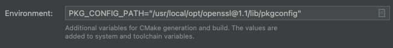

# Prerequisits

## MacOS

```
brew install PkgConfig
brew install glib
brew install librdkafka
brew install nlohmann-json 
```

## Ububtu Linux
```
sudo apt-get install -y pkg-config
sudo apt-get install -y librdkafka-dev
sudo apt-get install -y librdkafka++1
sudo apt-get install -y libglib2.0-dev
sudo apt-get install -y nlohmann-json-dev

# linux doens't have arc4random as part of its standard lib
sudo apt-get install -y libsd-dev
```


# Build

For pkg-config to find openssl@1.1 you may need to set:
```
export PKG_CONFIG_PATH="/usr/local/opt/openssl@1.1/lib/pkgconfig"
```

# CLion

For CLion's version of cmake to apply the above path you need to set it in
the cmake settings: 



# Binaries

## example-1

Simple producer/consumer


